# Hi 👋, I'm Azmil Mohammed 

### Creative Developer

- 🔭 I'm currently working on **Building and refining projects while exploring new ideas**

- 🌱 I'm currently learning **Learning through building**

- 💬 Ask me about **Projects, ideas, and building things**

- 📫 How to reach me **azmilmohammed369@gmail.com**

- 👨‍💻 Check out my portfolio at **[https://www.azmil.xyz](https://www.azmil.xyz)**

  

<h3 align="left">Connect with me:</h3>

  
  
  

<h3 align="left">Languages and Tools:</h3>

  

<h3 align="center">GitHub Stats</h3>

  

  

    
